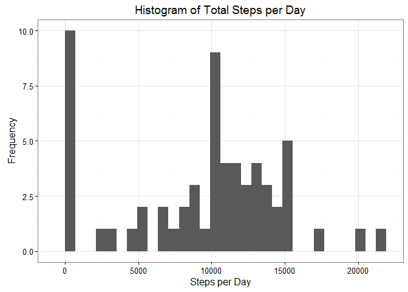
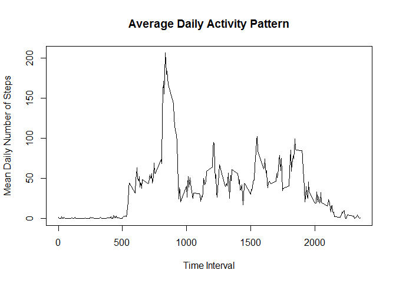
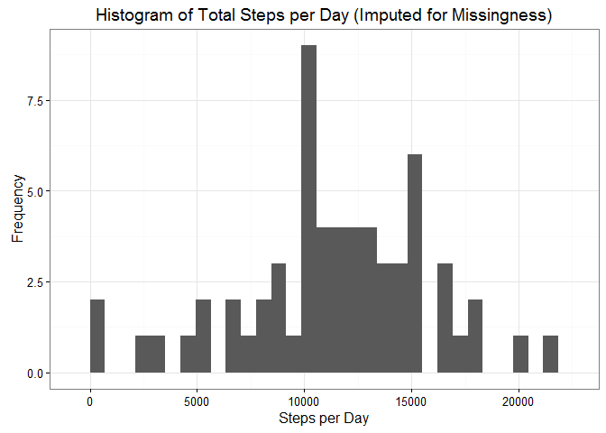
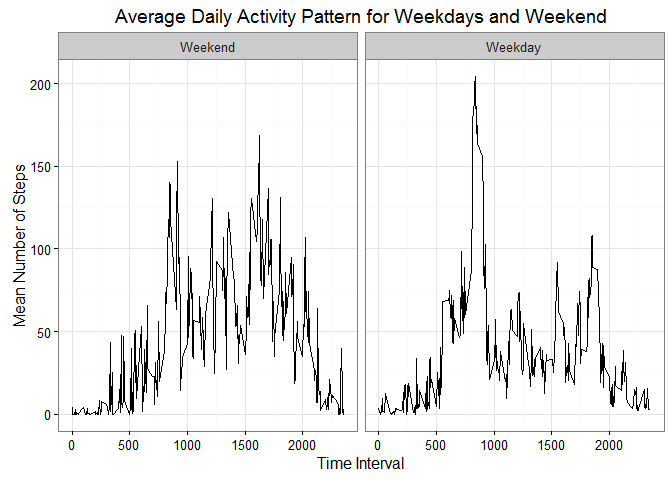

# Reproducible Research: Peer Assessment 1


## Loading and preprocessing the data

```r
getwd() 
```

```
## [1] "C:/Users/Alan/Documents/Reproduce/RepData_PeerAssessment1"
```

```r
setwd("C:/Users/Alan/Documents/Reproduce/RepData_PeerAssessment1")
library(downloader)
```

```
## Warning: package 'downloader' was built under R version 3.2.4
```

```r
if(file.exists("activity.zip")) {unzip("activity.zip", exdir = ".")}
if(file.exists("activity.csv")) 
{activity <- read.csv(file = "activity.csv", header = TRUE, sep = ",")}
activity$Dates <- as.Date(as.character(activity$date), format = "%Y-%m-%d")
str(activity)
```

```
## 'data.frame':	17568 obs. of  4 variables:
##  $ steps   : int  NA NA NA NA NA NA NA NA NA NA ...
##  $ date    : Factor w/ 61 levels "2012-10-01","2012-10-02",..: 1 1 1 1 1 1 1 1 1 1 ...
##  $ interval: int  0 5 10 15 20 25 30 35 40 45 ...
##  $ Dates   : Date, format: "2012-10-01" "2012-10-01" ...
```
###The acitivity dataset has been loaded in R studio and processed 


## What is mean total number of steps taken per day?

```r
library(dplyr)
```

```
## Warning: package 'dplyr' was built under R version 3.2.3
```

```
## 
## Attaching package: 'dplyr'
```

```
## The following objects are masked from 'package:stats':
## 
##     filter, lag
```

```
## The following objects are masked from 'package:base':
## 
##     intersect, setdiff, setequal, union
```

```r
date_activity <- group_by(activity, Dates)
stepsperday <- summarise(date_activity, sum(steps, na.rm = TRUE))
colnames(stepsperday)[2] <- "Sum"
library(ggplot2)
```

```
## Warning: package 'ggplot2' was built under R version 3.2.3
```

```r
histogram <- ggplot(stepsperday, aes(Sum))
histogram <- histogram + stat_bin() + theme_bw()
histogram <- histogram + labs(x="Steps per Day", y="Frequency", title="Histogram of Total Steps per Day")
print(histogram)
```

```
## `stat_bin()` using `bins = 30`. Pick better value with `binwidth`.
```

\


```r
meansteps <- mean(stepsperday$Sum)
mediansteps <- median(stepsperday$Sum)
```
###The mean total steps per day is 9354.2295082 and median total steps per day is 10395. 


## What is the average daily activity pattern?

```r
interval_activity <- group_by(activity, interval)
intervalmean <- summarise(interval_activity, mean(steps, na.rm=TRUE))
colnames(intervalmean)[2] <- "Mean" #Change column name
with(intervalmean, plot(interval, Mean, type="l", main="Average Daily Activity Pattern",
        ylab="Mean Daily Number of Steps", xlab="Time Interval"))
```

\


```r
interval <- subset(intervalmean, Mean==max(Mean))
```
###The 5-minute interval with the maximum number of steps averaged aross all days is 
835, 206.1698113.


## Imputing missing values

```r
complete <- complete.cases(activity)
missing <- sum(!complete)
```
###The number of cases with missing data is 2304.

```r
library(mice)
```

```
## Warning: package 'mice' was built under R version 3.2.5
```

```
## Loading required package: Rcpp
```

```
## Warning: package 'Rcpp' was built under R version 3.2.3
```

```
## mice 2.25 2015-11-09
```

```r
library(lubridate)
```

```
## Warning: package 'lubridate' was built under R version 3.2.3
```

```r
df <- activity[, -2]
df$Dates <- ymd(df$Dates)
df$days <- yday(df$Dates)
df$days <- df$days-275
df <- df[, -3]
imputed = mice(df, m=1, maxit=50, seed=999)
```

```
## 
##  iter imp variable
##   1   1  steps
##   2   1  steps
##   3   1  steps
##   4   1  steps
##   5   1  steps
##   6   1  steps
##   7   1  steps
##   8   1  steps
##   9   1  steps
##   10   1  steps
##   11   1  steps
##   12   1  steps
##   13   1  steps
##   14   1  steps
##   15   1  steps
##   16   1  steps
##   17   1  steps
##   18   1  steps
##   19   1  steps
##   20   1  steps
##   21   1  steps
##   22   1  steps
##   23   1  steps
##   24   1  steps
##   25   1  steps
##   26   1  steps
##   27   1  steps
##   28   1  steps
##   29   1  steps
##   30   1  steps
##   31   1  steps
##   32   1  steps
##   33   1  steps
##   34   1  steps
##   35   1  steps
##   36   1  steps
##   37   1  steps
##   38   1  steps
##   39   1  steps
##   40   1  steps
##   41   1  steps
##   42   1  steps
##   43   1  steps
##   44   1  steps
##   45   1  steps
##   46   1  steps
##   47   1  steps
##   48   1  steps
##   49   1  steps
##   50   1  steps
```

```r
imputeddf <- complete(imputed, action=1)
library(dplyr)
imputeddf_grouped <- group_by(imputeddf, days)
imputedstepsperday <- summarise(imputeddf_grouped, sum(steps, na.rm = TRUE))
colnames(imputedstepsperday)[2] <- "Sum"
library(ggplot2)
histogram_imputed <- ggplot(imputedstepsperday, aes(Sum))
histogram_imputed <- histogram_imputed + stat_bin() + theme_bw()
histogram_imputed <- histogram_imputed + labs(x="Steps per Day", y="Frequency", title="Histogram of Total Steps per Day (Imputed for Missingness)")
print(histogram_imputed)
```

```
## `stat_bin()` using `bins = 30`. Pick better value with `binwidth`.
```

\


```r
imputedmeansteps <- mean(imputedstepsperday$Sum)
imputedmediansteps <- median(imputedstepsperday$Sum)
```
###The mean and median number of total steps per day in the imputed date frame are 1.1446262\times 10^{4} and 11458, respectively


## Are there differences in activity patterns between weekdays and weekends?

```r
imputeddf <- imputeddf[,1:2]
imputeddf <- cbind(imputeddf, activity[[4]])
colnames(imputeddf)[3] <- "Date"
imputeddf$Day <- weekdays(imputeddf$Date)
attach(imputeddf)
```

```
## The following object is masked _by_ .GlobalEnv:
## 
##     interval
```

```r
imputeddf$Weekday[Day=="Monday" | Day=="Tuesday" | Day=="Wednesday" | Day=="Thursday" | Day=="Friday"] <- 1
imputeddf$Weekday[Day=="Saturday" | Day=="Sunday"] <- 0
imputeddf$Weekday <- factor(imputeddf$Weekday, labels = c("Weekend", "Weekday"))
table(imputeddf$Weekday)
```

```
## 
## Weekend Weekday 
##    4608   12960
```

```r
library(dplyr)
averageactivity <- group_by(imputeddf, Weekday, interval)
averagesteps <- summarise(averageactivity, mean(steps, na.rm=TRUE))
colnames(averagesteps)[3] <- "Mean"
library(ggplot2)
lineplot <- ggplot(averagesteps, aes(x=interval, y=Mean)) + geom_line()
lineplot <- lineplot + facet_grid(. ~ Weekday) + theme_bw() 
lineplot <- lineplot + ggtitle("Average Daily Activity Pattern for Weekdays and Weekend")
lineplot <- lineplot + xlab("Time Interval") + ylab("Mean Number of Steps") #Axis titles
print(lineplot)
```

\
